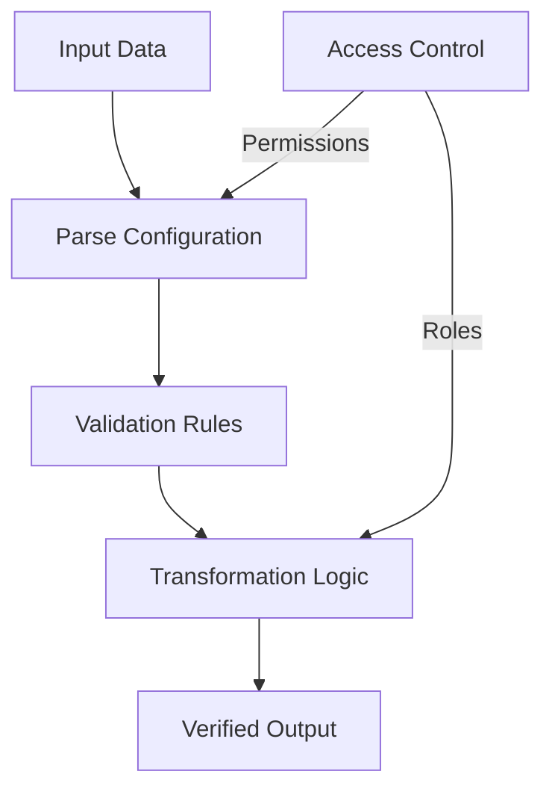

# Federated Parse Interface

A decentralized middleware smart contract for secure, flexible data parsing and cross-system interaction using blockchain technology.

## Overview

Federated Parse Interface provides a robust, blockchain-native framework for parsing, transforming, and securely routing structured data across distributed systems. By leveraging smart contract technology, it enables trustless data interpretation and verification.

### Key Features
- Decentralized data parsing middleware
- Flexible parsing interface for multiple data structures
- Secure, verifiable data transformation
- Cross-system interoperability
- Immutable parsing rules and configurations
- Role-based access for data processing

## Architecture

The Federated Parse Interface uses a smart contract to manage parsing configurations, validation rules, and transaction tracking.



### Core Components
- **Parsers**: Configurable data parsing interfaces
- **Configurations**: Rule sets for data transformation
- **Validations**: Integrity checks and verification mechanisms
- **Permissions**: Role-based access control
- **Logs**: Immutable transaction tracking

## Contract Documentation

### federated-parser.clar
The core contract managing parsing and data interaction logic.

#### Key Maps
- `users`: Manages user roles and permissions
- `parser-configs`: Stores parsing configuration rules
- `parsing-logs`: Tracks parsing transactions
- `validation-rules`: Defines data integrity checks

#### Access Control
- Role-based parsing permissions
- Configurable validation strategies
- Secure, auditable data processing

## Getting Started

### Prerequisites
- Clarinet
- Stacks blockchain wallet
- Development environment for Clarity

### Basic Usage

1. Register a parser user:
```clarity
(contract-call? .federated-parser register-user "Data Analyst" u2)
```

2. Create a parsing configuration:
```clarity
(contract-call? .federated-parser create-parser-config 
    "JSON Transformer" 
    "Basic JSON parsing and transformation")
```

3. Define parsing rules:
```clarity
(contract-call? .federated-parser set-parsing-rule 
    u1  ;; parser-config-id
    "field-mapping"  ;; rule-type
    "{...}")  ;; rule configuration
```

## Development

### Testing
1. Clone the repository
2. Install Clarinet
3. Run `clarinet test`
4. Use `clarinet console` for interactive testing

### Local Development
1. Set up local Clarinet chain
2. Deploy contracts using `clarinet deploy`
3. Interact through console or API

## Security Considerations

### Permissions and Access Control
- Strict role-based parsing access
- Immutable parsing configurations
- Comprehensive validation mechanisms

### Known Limitations
- Parser configurations are append-only
- Complex transformations require careful design
- External data sources must be carefully validated

### Best Practices
- Design granular access roles
- Implement comprehensive validation rules
- Log and audit all parsing transactions
- Use modular, reusable parsing configurations# Federated Parse Interface

A decentralized middleware smart contract for secure, flexible data parsing and cross-system interaction using blockchain technology.

## Overview

Federated Parse Interface provides a robust, blockchain-native framework for parsing, transforming, and securely routing structured data across distributed systems. By leveraging smart contract technology, it enables trustless data interpretation and verification.

### Key Features
- Decentralized data parsing middleware
- Flexible parsing interface for multiple data structures
- Secure, verifiable data transformation
- Cross-system interoperability
- Immutable parsing rules and configurations
- Role-based access for data processing

## Architecture

The Federated Parse Interface uses a smart contract to manage parsing configurations, validation rules, and transaction tracking.


### Core Components
- **Parsers**: Configurable data parsing interfaces
- **Configurations**: Rule sets for data transformation
- **Validations**: Integrity checks and verification mechanisms
- **Permissions**: Role-based access control
- **Logs**: Immutable transaction tracking

## Contract Documentation

### federated-parser.clar
The core contract managing parsing and data interaction logic.

#### Key Maps
- `users`: Manages user roles and permissions
- `parser-configs`: Stores parsing configuration rules
- `parsing-logs`: Tracks parsing transactions
- `validation-rules`: Defines data integrity checks

#### Access Control
- Role-based parsing permissions
- Configurable validation strategies
- Secure, auditable data processing

## Getting Started

### Prerequisites
- Clarinet
- Stacks blockchain wallet
- Development environment for Clarity

### Basic Usage

1. Register a parser user:
```clarity
(contract-call? .federated-parser register-user "Data Analyst" u2)
```

2. Create a parsing configuration:
```clarity
(contract-call? .federated-parser create-parser-config 
    "JSON Transformer" 
    "Basic JSON parsing and transformation")
```

3. Define parsing rules:
```clarity
(contract-call? .federated-parser set-parsing-rule 
    u1  ;; parser-config-id
    "field-mapping"  ;; rule-type
    "{...}")  ;; rule configuration
```

## Development

### Testing
1. Clone the repository
2. Install Clarinet
3. Run `clarinet test`
4. Use `clarinet console` for interactive testing

### Local Development
1. Set up local Clarinet chain
2. Deploy contracts using `clarinet deploy`
3. Interact through console or API

## Security Considerations

### Permissions and Access Control
- Strict role-based parsing access
- Immutable parsing configurations
- Comprehensive validation mechanisms

### Known Limitations
- Parser configurations are append-only
- Complex transformations require careful design
- External data sources must be carefully validated

### Best Practices
- Design granular access roles
- Implement comprehensive validation rules
- Log and audit all parsing transactions
- Use modular, reusable parsing configurations